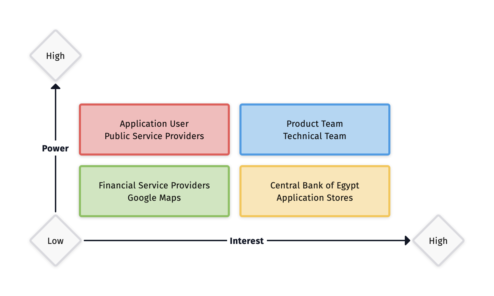

# Case Study: Stakeholder Engagement & Communication Plan

## Task

As per [Stakeholders List](./S_PM_01.md), you need to develop:
- Stakeholder Management Plan
- Communications Management Plan

## Stakeholder Analysis

## Stakeholder Assessment Matrix

| Stakeholder                 | Unaware | Resistant | Neutral | Supportive | Leading |
|-----------------------------|---------|-----------|---------|------------|---------|
| Application User            |         |           |         | C D        |         |
| Product Team                |         |           |         | C          | D       |
| Technical Team              |         |           |         | C          | D       |
| Public Service Providers    |         |           |         | C D        |         |
| Central Bank of Egypt       |         | C         | D       |            |         |
| Financial Service Providers |         |           |         | C D        |         |
| Google Maps                 |         |           |         | C D        |         |
| Application Store           |         | C         | D       |            |         |

**Notes:**
- **Product Team & Technical Team:** are aimed to be moved from Supportive side to Leading side gradually after delivering
the first 4 or 6 sprints; so their engagement with the other stakeholders could be effective accordingly.
- **Central Bank of Egypt:** is aimed to be moved from _Resistant_ side to _Neutral_ side by putting their regulations 
and testing rules as a high priority during planning, to overcome such rejection issues that might delay our go live.
- **Application Store:** is aimed to be moved from _Resistant_ side to _Neutral_ side by following security guidelines and their policies
during each delivery or feature implementation.

## Communications Management Plan

| Message/Purpose       | Responsibility               | Audience                                               | Medium  | Contents                       | Frequency/Timing |
|-----------------------|------------------------------|--------------------------------------------------------|---------|--------------------------------|------------------|
| Features Status       | Product Team, Technical Team | PM                                                     | Meeting | Commitment, Risks, Compliance  | Daily            |
| Project Status        | PM                           | Public Service Providers                               | Meeting | Issues, Risks                  | Bi-weekly        |
| Product Team Status   | Product Owner                | Product Team                                           | Meeting | Internal Commitment            | Daily            |
| Technical Team Status | Technical Lead               | Technical Team, Product Team                           | Meeting | Internal Commitment            | Daily            |
| Project Review        | PM, Product Owner            | PM, Technical Team, Product Team                       | Meeting | Demo, Best Efforts, Left-overs | Bi-weekly        |
| Audit                 | Technical Team               | PM, Central Bank of Egypt, Financial Service Providers | Meeting | ETE Testing, Review            | Monthly          |
| Project Status Report | PM, Product Owner            | Technical Team, Product Team, Public Service Providers | Meeting | Releases, Issues, Risks        | Weekly/Bi-weekly |
