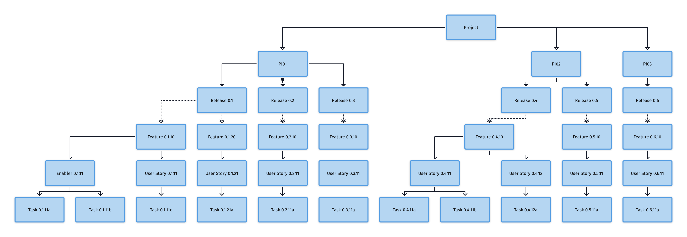

# Case Study: Create WBS for your project

## Task

As a PM, Create a Work Breakdown Structure for your project.

## Solution

**Project** is break down into **PIs**, each **PI** has duration of 6 weeks, including set of **Features**, each **Sprint** claims a group of **Features**
depending on the priority, each **Feature** includes Business **User Stories** and Technical **Enablers** (if needed), both of them should contain one **Task** or more.

