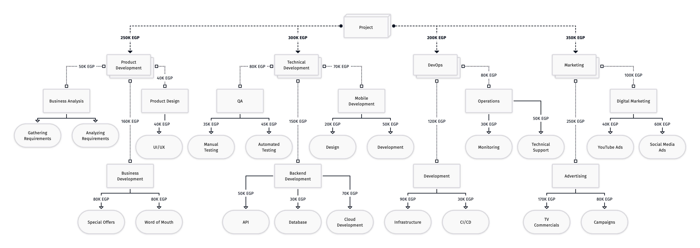

# Case Study: Estimation

## Task

Develop a Project Estimate and Assumptions List

## Solution

### Estimation Diagram

Using **Top Down approach** based on the initial limited budget, assuming the resources initial budget is 1,100,000 EGP

### Assumptions List

- Use Agile approach and build self-managed teams.
- Eliminate time waste for each team to be committed and dedicated for their deliveries.
- Use Jira for Features/Releases management.
- Create Organization/Business account on Microsoft/Google.
- Create AWS Enterprise account with development, testing, and production environments.
