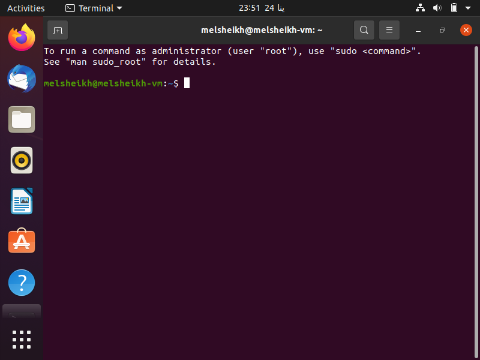

# Linux - Lab 01

## Task Checklist

1. Install Ubuntu OS using Virtual Machine.
2. What is the difference between `cat` and `more` command?
3. What is the difference between `rm` and `rmdir` using `man`?
4. Copy the `/etc/passwd` file to your home directory making its name is `mypasswd`.
5. Rename this new file to be `oldpasswd`.
6. You are in `/usr/bin`, list four ways to go to your `home` directory
7. List Linux commands in `/usr/bin` that start with letter `w`
8. Display the first 4 lines of `/etc/passwd`
9. Display the last 7 lines of `/etc/passwd`
10. Display the `man` pages of `passwd` the command and the file sequentially in one command.
11. Display the `man` page of the `passwd` file.
12. Display a list of all the commands that contain the keyword `passwd` in their `man` page.

## Solution

1. [x] Install Ubuntu OS using Virtual Machine.

<details>
    <summary>Click to show the VM screenshot</summary>


</details>

2. [x] Difference between `cat` and `more` command

> Both `cat` and `more` commands are used to show content of file

> `more` command is used to show content of the file in a buffer that fits the entire screen, so you can click on `Enter` button to show more lines.

<details>
  <summary>Click here to show <code>man cat</code> output</summary>

```
CAT(1)                                                                                                        User Commands                                                                                                       CAT(1)

NAME
cat - concatenate files and print on the standard output

SYNOPSIS
cat [OPTION]... [FILE]...

DESCRIPTION
Concatenate FILE(s) to standard output.

With no FILE, or when FILE is -, read standard input.
```

</details>


> `cat` command is used to show content of the whole file


<details>
  <summary>Click here to show <code>man more</code> output</summary>

```
MORE(1)                                                                                                       User Commands                                                                                                      MORE(1)

NAME
       more - file perusal filter for crt viewing

SYNOPSIS
       more [options] file...

DESCRIPTION
       more is a filter for paging through text one screenful at a time.  This version is especially primitive.  Users should realize that less(1) provides more(1) emulation plus extensive enhancements.

```

</details>

3. [x] Difference between `rm` and `rmdir` command

> Both `rm` and `rmdir` commands are used to remove directories.

> `rm` command is used to remove either files or directories. Command can delete directories with options recursively by removing all included files/directories.

<details>
  <summary>Click here to show <code>man rm</code> output</summary>

```
RM(1)                                                                                                         User Commands                                                                                                        RM(1)

NAME
       rm - remove files or directories

SYNOPSIS
       rm [OPTION]... [FILE]...

DESCRIPTION
       This manual page documents the GNU version of rm.  rm removes each specified file.  By default, it does not remove directories.

       If  the -I or --interactive=once option is given, and there are more than three files or the -r, -R, or --recursive are given, then rm prompts the user for whether to proceed with the entire operation.  If the response is not
       affirmative, the entire command is aborted.

       Otherwise, if a file is unwritable, standard input is a terminal, and the -f or --force option is not given, or the -i or --interactive=always option is given, rm prompts the user for whether to remove the file.  If  the  re-
       sponse is not affirmative, the file is skipped.

```

</details>

> `rmdir` command is used to remove directories only. Command cannot be used unless the directory is empty.

<details>
  <summary>Click here to show <code>man rmdir</code> output</summary>

```
RMDIR(1)                                                                                                      User Commands                                                                                                     RMDIR(1)

NAME
       rmdir - remove empty directories

SYNOPSIS
       rmdir [OPTION]... DIRECTORY...

DESCRIPTION
       Remove the DIRECTORY(ies), if they are empty.

```

</details>

4. [x] Copy the `/etc/passwd` file to your home directory making its name is `mypasswd`.
5. [x] Rename this new file to be `oldpasswd`.

```shell
cp /etc/passwd ~/mypasswd  # Copy the `/etc/passwd` file to your home directory making its name is `mypasswd`.
mv ~/mypasswd ~/oldpasswd  # Rename this new file to be `oldpasswd`.
```

6. [x] You are in `/usr/bin`, list four ways to go to your `home` directory

```shell
cd /usr/bin  # You are in `/usr/bin`
# list four ways to go to your `home` directory
ls ~  # First way
```
<details>
    <summary>Click here to show the Output</summary>

```shell
mypasswd
```
</details>

```shell
ls /home/$USER  # Second way
```
<details>
    <summary>Click here to show the Output</summary>

```shell
mypasswd
```
</details>

```shell
ls $HOME  # Third way
```
<details>
    <summary>Click here to show the Output</summary>

```shell
mypasswd
```
</details>

```shell
ls /home/$(whoami)  # Fourth way
```
<details>
    <summary>Click here to show the Output</summary>

```shell
mypasswd
```
</details>

7. [x] List Linux commands in `/usr/bin` that start with letter `w`
```shell
ls /usr/bin/ | grep -w w*
```
<details>
    <summary>Click here to show the Output</summary>

```shell
Binary file w.procps matches
Binary file wall matches
Binary file watch matches
Binary file wc matches
Binary file wdctl matches
Binary file whatis matches
Binary file whereis matches
Binary file who matches
Binary file whoami matches
Binary file write matches
```
</details>

8. [x] Display the first 4 lines of `/etc/passwd`
```shell
head -4 /etc/passwd
```
<details>
    <summary>Click here to show the Output</summary>

```shell
root:x:0:0:root:/root:/bin/bash
daemon:x:1:1:daemon:/usr/sbin:/usr/sbin/nologin
bin:x:2:2:bin:/bin:/usr/sbin/nologin
sys:x:3:3:sys:/dev:/usr/sbin/nologin
```
</details>

9. [x] Display the last 7 lines of `/etc/passwd`
```shell
tail -7 /etc/passwd
```
<details>
    <summary>Click here to show the Output</summary>

```shell
www-data:x:33:33:www-data:/var/www:/usr/sbin/nologin
backup:x:34:34:backup:/var/backups:/usr/sbin/nologin
list:x:38:38:Mailing List Manager:/var/list:/usr/sbin/nologin
irc:x:39:39:ircd:/var/run/ircd:/usr/sbin/nologin
gnats:x:41:41:Gnats Bug-Reporting System (admin):/var/lib/gnats:/usr/sbin/nologin
nobody:x:65534:65534:nobody:/nonexistent:/usr/sbin/nologin
_apt:x:100:65534::/nonexistent:/usr/sbin/nologin
```
</details>

10. [x] Display the `man` pages of `passwd` the command and the file sequentially in one command.

```shell
man -a -w passwd | xargs cat
```

11. [x] Display the `man` page of the `passwd` file.

```shell
man -a passwd
```
<details>
    <summary>Click here to show the First Page - PASSWD(1)</summary>

```shell
PASSWD(1)                                                                                                     User Commands                                                                                                    PASSWD(1)

NAME
       passwd - change user password

SYNOPSIS
       passwd [options] [LOGIN]

DESCRIPTION
       The passwd command changes passwords for user accounts. A normal user may only change the password for their own account, while the superuser may change the password for any account.  passwd also changes the account or
       associated password validity period.

   Password Changes
       The user is first prompted for their old password, if one is present. This password is then encrypted and compared against the stored password. The user has only one chance to enter the correct password. The superuser is
       permitted to bypass this step so that forgotten passwords may be changed.

       After the password has been entered, password aging information is checked to see if the user is permitted to change the password at this time. If not, passwd refuses to change the password and exits.

       The user is then prompted twice for a replacement password. The second entry is compared against the first and both are required to match in order for the password to be changed.

       Then, the password is tested for complexity. As a general guideline, passwords should consist of 6 to 8 characters including one or more characters from each of the following sets:

       o   lower case alphabetics

       o   digits 0 thru 9

       o   punctuation marks

       Care must be taken not to include the system default erase or kill characters.  passwd will reject any password which is not suitably complex.

   Hints for user passwords
       The security of a password depends upon the strength of the encryption algorithm and the size of the key space. The legacy UNIX System encryption method is based on the NBS DES algorithm. More recent methods are now
       recommended (see ENCRYPT_METHOD). The size of the key space depends upon the randomness of the password which is selected.

       Compromises in password security normally result from careless password selection or handling. For this reason, you should not select a password which appears in a dictionary or which must be written down. The password should
       also not be a proper name, your license number, birth date, or street address. Any of these may be used as guesses to violate system security.

       You can find advice on how to choose a strong password on http://en.wikipedia.org/wiki/Password_strength

```
</details>

<details>
    <summary>Click here to show the Second Page - PASSWD(5)</summary>

```shell
PASSWD(5)                                                                                             File Formats and Conversions                                                                                             PASSWD(5)

NAME
       passwd - the password file

DESCRIPTION
       /etc/passwd contains one line for each user account, with seven fields delimited by colons (":"). These fields are:

       o   login name

       o   optional encrypted password

       o   numerical user ID

       o   numerical group ID

       o   user name or comment field

       o   user home directory

       o   optional user command interpreter

       If the password field is a lower-case "x", then the encrypted password is actually stored in the shadow(5) file instead; there must be a corresponding line in the /etc/shadow file, or else the user account is invalid.

       The encrypted password field may be empty, in which case no password is required to authenticate as the specified login name. However, some applications which read the /etc/passwd file may decide not to permit any access at
       all if the password field is blank.

       A password field which starts with an exclamation mark means that the password is locked. The remaining characters on the line represent the password field before the password was locked.

       Refer to crypt(3) for details on how this string is interpreted.

       If the password field contains some string that is not a valid result of crypt(3), for instance ! or *, the user will not be able to use a unix password to log in (but the user may log in the system by other means).

       The comment field is used by various system utilities, such as finger(1).

       The home directory field provides the name of the initial working directory. The login program uses this information to set the value of the $HOME environmental variable.

       The command interpreter field provides the name of the user's command language interpreter, or the name of the initial program to execute. The login program uses this information to set the value of the $SHELL environmental
       variable. If this field is empty, it defaults to the value /bin/sh.

```
</details>

12. [x] Display a list of all the commands that contain the keyword `passwd` in their `man` page.

```shell
man -k passwd
```

<details>
    <summary>Click here to show the Output</summary>

```shell
chgpasswd (8)        - update group passwords in batch mode
chpasswd (8)         - update passwords in batch mode
gpasswd (1)          - administer /etc/group and /etc/gshadow
pam_localuser (8)    - require users to be listed in /etc/passwd
passwd (1)           - change user password
passwd (5)           - the password file
update-passwd (8)    - safely update /etc/passwd, /etc/shadow and /etc/group
```
</details>
