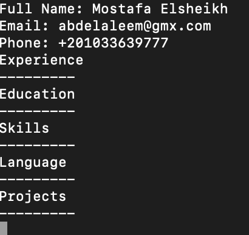
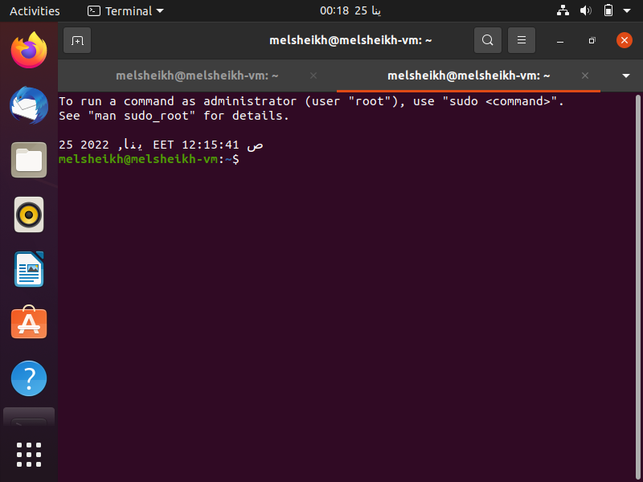
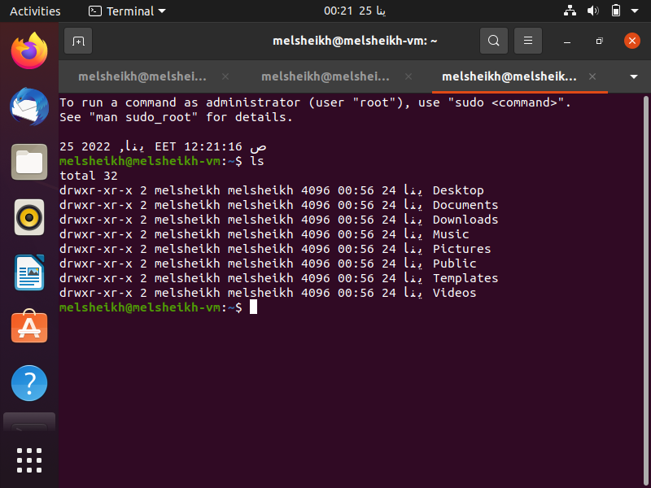

# Linux - Lab 02

## Task Checklist

1. Using `vi` write your CV in the file `mycv`. Your CV should include your name, age, school, college, experience,...
2. Open `mycv` file using `vi` command then: Without using arrows state how to:
   1. Move the cursor down one line at time.
   2. Move the cursor up one line at time.
   3. Search for word age
   4. Step to line 5 (assuming that you are in line 1 and file is more than 5 lines).
   5. Delete the line you are on and line 5.
   6. How to step to the end of line and change to writing mode in one-step.
3. List the available shells in your system.
4. List the environment variables in your current shell.
5. List all the environment variables for the bash shell.
6. What are the commands that list the value of a specific variable?
7. Display your current shell name.
8. State the initialization files of: sh, ksh, bash.
9. Edit in your profile to display date at login and change your prompt permanently.
10. Create a Bash shell alias named ls for the “ls –l” command.

## Solution

1. [x] Using `vi` write your CV in the file `mycv`. Your CV should include your name, age, school, college, experience,...
```shell
vi mycv 
```
<details>
   <summary>Click here to show the sample <code>mycv</code> file</summary>


</details>

2. [x] Open `mycv` file using `vi` command then: Without using arrows state how to:
```shell
vi mycv 
```
   1. Move the cursor down one line at time.
      ```shell
      Shift+4
      ```
   2. Move the cursor up one line at time.
      ```shell
      k
      ```
   3. Search for word `Skills`
      ```shell
      /Skills
      ```
   4. Step to line 5 (assuming that you are in line 1 and file is more than 5 lines).
      ```shell
      5j
      ```
   5. Delete the line you are on and line 5.
      ```shell
      dd
      ```
   6. How to step to the end of line and change to writing mode in one-step.
      ```shell
      Go
      ```
---
   
3. [x] List the available shells in your system.
```shell
cat /etc/shells
```
<details>
   <summary>Click here to show the output</summary>

```shell
# /etc/shells: valid login shells
/bin/sh
/bin/bash
/usr/bin/bash
/bin/rbash
/usr/bin/rbash
/bin/dash
/usr/bin/dash
```
</details>

4. [x] List the environment variables in your current shell.
```shell
printenv
```
<details>
   <summary>Click here to show the output</summary>

```shell
HOSTNAME=docker-desktop
PWD=/tmp
HOME=/root
LS_COLORS=rs=0:di=01;34:ln=01;36:mh=00:pi=40;33:so=01;35:do=01;35:bd=40;33;01:cd=40;33;01:or=40;31;01:mi=00:su=37;41:sg=30;43:ca=30;41:tw=30;42:ow=34;42:st=37;44:ex=01;32:*.tar=01;31:*.tgz=01;31:*.arc=01;31:*.arj=01;31:*.taz=01;31:*.lha=01;31:*.lz4=01;31:*.lzh=01;31:*.lzma=01;31:*.tlz=01;31:*.txz=01;31:*.tzo=01;31:*.t7z=01;31:*.zip=01;31:*.z=01;31:*.dz=01;31:*.gz=01;31:*.lrz=01;31:*.lz=01;31:*.lzo=01;31:*.xz=01;31:*.zst=01;31:*.tzst=01;31:*.bz2=01;31:*.bz=01;31:*.tbz=01;31:*.tbz2=01;31:*.tz=01;31:*.deb=01;31:*.rpm=01;31:*.jar=01;31:*.war=01;31:*.ear=01;31:*.sar=01;31:*.rar=01;31:*.alz=01;31:*.ace=01;31:*.zoo=01;31:*.cpio=01;31:*.7z=01;31:*.rz=01;31:*.cab=01;31:*.wim=01;31:*.swm=01;31:*.dwm=01;31:*.esd=01;31:*.jpg=01;35:*.jpeg=01;35:*.mjpg=01;35:*.mjpeg=01;35:*.gif=01;35:*.bmp=01;35:*.pbm=01;35:*.pgm=01;35:*.ppm=01;35:*.tga=01;35:*.xbm=01;35:*.xpm=01;35:*.tif=01;35:*.tiff=01;35:*.png=01;35:*.svg=01;35:*.svgz=01;35:*.mng=01;35:*.pcx=01;35:*.mov=01;35:*.mpg=01;35:*.mpeg=01;35:*.m2v=01;35:*.mkv=01;35:*.webm=01;35:*.ogm=01;35:*.mp4=01;35:*.m4v=01;35:*.mp4v=01;35:*.vob=01;35:*.qt=01;35:*.nuv=01;35:*.wmv=01;35:*.asf=01;35:*.rm=01;35:*.rmvb=01;35:*.flc=01;35:*.avi=01;35:*.fli=01;35:*.flv=01;35:*.gl=01;35:*.dl=01;35:*.xcf=01;35:*.xwd=01;35:*.yuv=01;35:*.cgm=01;35:*.emf=01;35:*.ogv=01;35:*.ogx=01;35:*.aac=00;36:*.au=00;36:*.flac=00;36:*.m4a=00;36:*.mid=00;36:*.midi=00;36:*.mka=00;36:*.mp3=00;36:*.mpc=00;36:*.ogg=00;36:*.ra=00;36:*.wav=00;36:*.oga=00;36:*.opus=00;36:*.spx=00;36:*.xspf=00;36:
TERM=xterm
SHLVL=1
PATH=/usr/local/sbin:/usr/local/bin:/usr/sbin:/usr/bin:/sbin:/bin
_=/usr/bin/printenv
OLDPWD=/usr/bin
```
</details>

5. [x] List all the environment variables for the bash shell.
```shell
set -o posix ; set
```
<details>
   <summary>Click here to show the output</summary>

```shell
BASH=/usr/bin/bash
BASHOPTS=checkwinsize:cmdhist:complete_fullquote:expand_aliases:extquote:force_fignore:globasciiranges:histappend:hostcomplete:interactive_comments:progcomp:promptvars:sourcepath
BASH_ALIASES=()
BASH_ARGC=([0]="0")
BASH_ARGV=()
BASH_CMDS=()
BASH_LINENO=()
BASH_SOURCE=()
BASH_VERSINFO=([0]="5" [1]="0" [2]="17" [3]="1" [4]="release" [5]="x86_64-pc-linux-gnu")
BASH_VERSION='5.0.17(1)-release'
COLUMNS=238
DIRSTACK=()
EUID=0
F=2
GROUPS=()
HISTCONTROL=ignoredups:ignorespace
HISTFILE=/root/.bash_history
HISTFILESIZE=2000
HISTSIZE=1000
HOME=/root
HOSTNAME=docker-desktop
HOSTTYPE=x86_64
IFS=' 	
'
LINES=64
LS_COLORS='rs=0:di=01;34:ln=01;36:mh=00:pi=40;33:so=01;35:do=01;35:bd=40;33;01:cd=40;33;01:or=40;31;01:mi=00:su=37;41:sg=30;43:ca=30;41:tw=30;42:ow=34;42:st=37;44:ex=01;32:*.tar=01;31:*.tgz=01;31:*.arc=01;31:*.arj=01;31:*.taz=01;31:*.lha=01;31:*.lz4=01;31:*.lzh=01;31:*.lzma=01;31:*.tlz=01;31:*.txz=01;31:*.tzo=01;31:*.t7z=01;31:*.zip=01;31:*.z=01;31:*.dz=01;31:*.gz=01;31:*.lrz=01;31:*.lz=01;31:*.lzo=01;31:*.xz=01;31:*.zst=01;31:*.tzst=01;31:*.bz2=01;31:*.bz=01;31:*.tbz=01;31:*.tbz2=01;31:*.tz=01;31:*.deb=01;31:*.rpm=01;31:*.jar=01;31:*.war=01;31:*.ear=01;31:*.sar=01;31:*.rar=01;31:*.alz=01;31:*.ace=01;31:*.zoo=01;31:*.cpio=01;31:*.7z=01;31:*.rz=01;31:*.cab=01;31:*.wim=01;31:*.swm=01;31:*.dwm=01;31:*.esd=01;31:*.jpg=01;35:*.jpeg=01;35:*.mjpg=01;35:*.mjpeg=01;35:*.gif=01;35:*.bmp=01;35:*.pbm=01;35:*.pgm=01;35:*.ppm=01;35:*.tga=01;35:*.xbm=01;35:*.xpm=01;35:*.tif=01;35:*.tiff=01;35:*.png=01;35:*.svg=01;35:*.svgz=01;35:*.mng=01;35:*.pcx=01;35:*.mov=01;35:*.mpg=01;35:*.mpeg=01;35:*.m2v=01;35:*.mkv=01;35:*.webm=01;35:*.ogm=01;35:*.mp4=01;35:*.m4v=01;35:*.mp4v=01;35:*.vob=01;35:*.qt=01;35:*.nuv=01;35:*.wmv=01;35:*.asf=01;35:*.rm=01;35:*.rmvb=01;35:*.flc=01;35:*.avi=01;35:*.fli=01;35:*.flv=01;35:*.gl=01;35:*.dl=01;35:*.xcf=01;35:*.xwd=01;35:*.yuv=01;35:*.cgm=01;35:*.emf=01;35:*.ogv=01;35:*.ogx=01;35:*.aac=00;36:*.au=00;36:*.flac=00;36:*.m4a=00;36:*.mid=00;36:*.midi=00;36:*.mka=00;36:*.mp3=00;36:*.mpc=00;36:*.ogg=00;36:*.ra=00;36:*.wav=00;36:*.oga=00;36:*.opus=00;36:*.spx=00;36:*.xspf=00;36:'
MACHTYPE=x86_64-pc-linux-gnu
MAILCHECK=60
OLDPWD=/usr/bin
OPTERR=1
OPTIND=1
OSTYPE=linux-gnu
PATH=/usr/local/sbin:/usr/local/bin:/usr/sbin:/usr/bin:/sbin:/bin
PIPESTATUS=([0]="0")
POSIXLY_CORRECT=y
PPID=0
PS1='\[\e]0;\u@\h: \w\a\]${debian_chroot:+($debian_chroot)}\u@\h:\w\$ '
PS2='> '
PS4='+ '
PWD=/tmp
SHELL=/bin/bash
SHELLOPTS=braceexpand:emacs:hashall:histexpand:history:interactive-comments:monitor:posix
SHLVL=1
TERM=xterm
UID=0
_=posix
```
</details>

6. [x] What are the commands that list the value of a specific variable?
```shell
printenv PWD
echo $PWD
```

7. [x] Display your current shell name.
```shell
echo $SHELL
```
<details>
   <summary>Click here to show the output</summary>

```shell
/bin/bash
```
</details>

```shell
echo $0
```
<details>
   <summary>Click here to show the output</summary>

```shell
bash
```
</details>

8. [x] State the initialization files of: sh, ksh, bash.

Initialization files of `sh` (Bourne Shell):
- `.dtprofile` in home directory (if user logs into a console using CDE)
- `/etc/profile`
- `.profile` in home directory

Initialization files of `ksh` (Korn Shell):
- `.dtprofile` in home directory (if user logs into a console using CDE)
- `/etc/profile`
- `.profile` in home directory
- `.kshrc` in home directory

Initialization files of `bash` (Bourne-Again SHell) :
- `/etc/profile` – it stores system-wide environment configurations and startup programs for login setup.
- `/etc/profile.d/` directory – stores shell scripts used to make custom changes to your environment
- `/etc/bashrc` or `/etc/bash.bashrc` file – contains system-wide functions and aliases including other configurations that apply to all system users.
- `~/.bash_profile` file – this stores user specific environment and startup programs configurations.


9. [x] Edit in your profile to display date at login and change your prompt permanently.

```shell
vi ~/.bashrc
```
Then type `Go` to switch to INSERT mode at the end of the file
Type `date`, then save the file by typing `:wq`

<details>
   <summary>Click here to see new Terminal tab</summary>


</details>

10. [x] Create a Bash shell alias named ls for the “ls –l” command.

```shell
vi ~/.bashrc
```
Then type `Go` to switch to INSERT mode at the end of the file
Type `alias ls = "ls -l"`, then save the file by typing `:wq`

<details>
   <summary>Click here to see output</summary>


</details>
